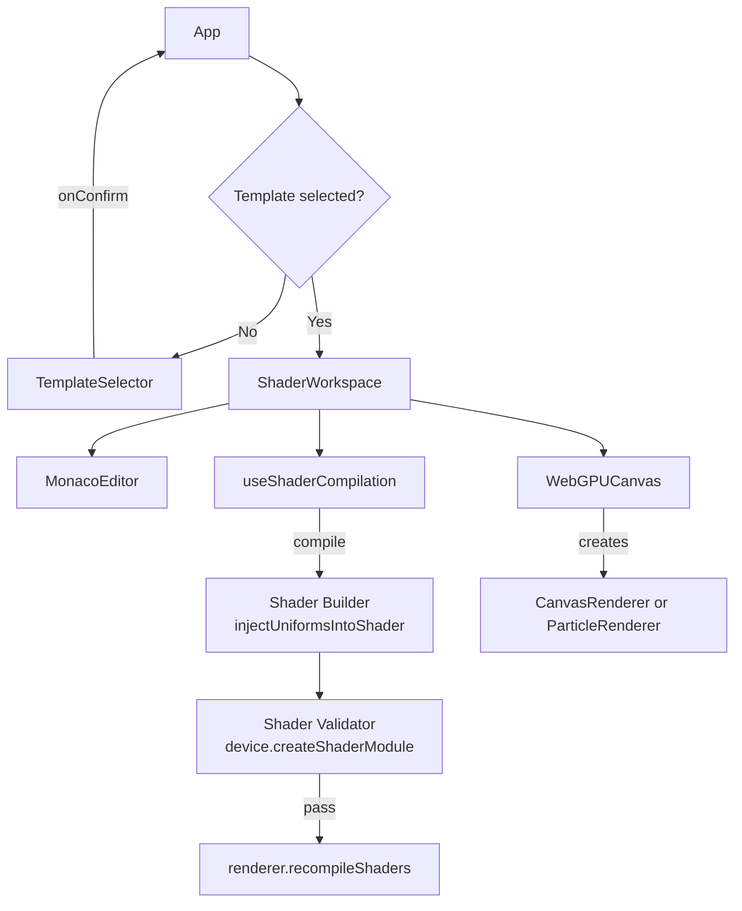
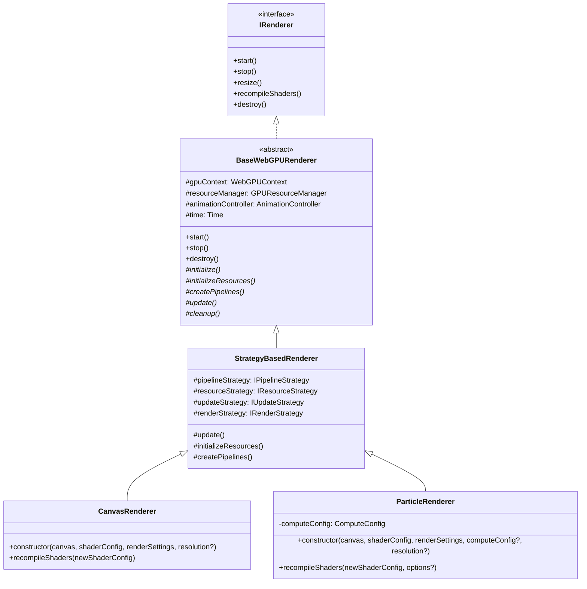
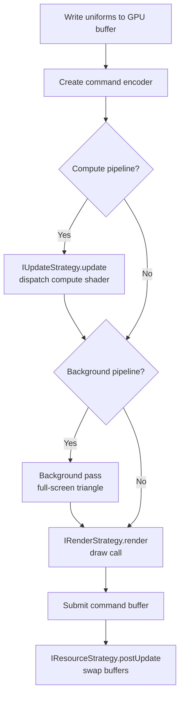
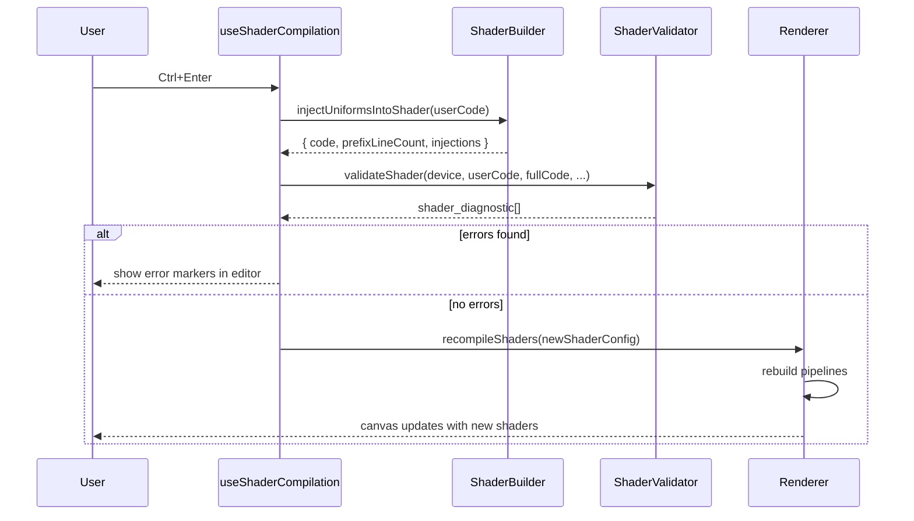

[//]: <> (AI was used in the making of this file for diagrams and layout. Has been reviewed multiple times for accuracy)
# Architecture

This page explains how the major pieces of WebGPU Fiddle fit together, from the React UI down to the GPU.

## High-Level Overview



**App** holds the top-level state: which template is selected, render settings, and dark mode. When no template is selected, it shows the **TemplateSelector**. Once the user picks one, it renders **ShaderWorkspace**, which composes the editor and canvas side by side.

**ShaderWorkspace** wires everything together. The **useShaderCompilation** hook manages shader text, tab state, live validation, and compilation. The **WebGPUCanvas** component creates the appropriate renderer and exposes it via a ref so the hook can call `recompileShaders()` when the user compiles.

## Component Tree

```
App
+-- TemplateSelector          (shown when no template is selected)
+-- RenderSettings            (shown when settings dialog is open)
+-- ShaderWorkspace
    +-- Toolbar               (compile, template switch, settings, download/upload, share, dark mode)
    +-- SplitPane
        +-- WebGPUCanvas      (left panel, creates and owns the renderer)
        +-- MonacoEditor      (right panel, tabbed WGSL editor)
```

## Renderer Class Hierarchy

The rendering system uses a combination of the **template method** pattern and the **strategy** pattern.



**BaseWebGPURenderer** defines the lifecycle as a template method: `start()` calls `initialize()`, which calls `initializeResources()` then `createPipelines()`. The animation loop calls `update()` every frame. Subclasses implement these abstract methods.

**StrategyBasedRenderer** implements those abstract methods by delegating to four strategy interfaces. This avoids duplicating lifecycle logic across renderer types. The concrete renderers (`CanvasRenderer`, `ParticleRenderer`) just plug in different strategy implementations.

## Strategy Composition

Each renderer is composed of four strategies that handle different responsibilities:

| Strategy | Canvas Renderer | Particle Renderer |
|---|---|---|
| **IResourceStrategy** | `CanvasResourceStrategy` | `ParticleResourceStrategy` |
| **IPipelineStrategy** | `CanvasPipelineStrategy` | `ParticlePipelineStrategy` |
| **IUpdateStrategy** | `NullUpdateStrategy` | `ParticleComputeUpdateStrategy` |
| **IRenderStrategy** | `CanvasRenderStrategy` | `ParticleRenderStrategy` |

- **IResourceStrategy** creates and owns GPU buffers, bind groups, and bind group layouts. It also provides the `UniformBuffer` and handles post-update work like ping-pong buffer swaps.
- **IPipelineStrategy** builds the render pipeline (and compute pipeline for particles) from the shader code and the bind group layouts provided by the resource strategy.
- **IUpdateStrategy** runs per-frame compute work. For canvas renderers this is a no-op (`NullUpdateStrategy`). For particle renderers it dispatches the compute shader and swaps the input/output buffers.
- **IRenderStrategy** issues the draw call. Canvas renderers draw a full-screen triangle. Particle renderers optionally render a background pass (full-screen triangle) first, then draw instanced quads on top.

## Rendering Loop

Every frame, `StrategyBasedRenderer.update()` runs this sequence:



For **canvas renderers**, the compute and background steps are skipped and `postUpdate` is a no-op. The render pass draws 3 vertices (one oversized triangle covering the viewport).

For **particle renderers**, the compute shader runs first, writing to the output buffer. If a background shader is present, it renders a full-screen triangle pass first (clearing the screen), then the particle render pass draws on top with `loadOp: 'load'`. After submission, `postUpdate()` swaps the input and output buffers so the next frame reads from what was just written.

## Shader Compilation Flow

When the user presses Ctrl+Enter or clicks Compile:



The shader builder prepends the uniform struct and injects uniform assignment statements into every entry point. The validator compiles the full code on the GPU and remaps any error line numbers back to the user's original code. If validation passes, the renderer rebuilds its pipelines with the new shaders. For particle renderers, GPU buffers are only recreated if the struct layout, particle count, or initial data changes; otherwise only pipelines are rebuilt, preserving particle state.

In addition to compile-on-demand, the editor runs **live validation** with a 500ms debounce as you type, so errors appear without needing to hit compile.

## Ping-Pong Double Buffering

Particle templates use two storage buffers that alternate roles each frame:

```
Frame 1:  Compute reads Buffer A --> writes Buffer B
          Render reads Buffer A
          swap()

Frame 2:  Compute reads Buffer B --> writes Buffer A
          Render reads Buffer B
          swap()
```

This is managed by the `InputOutputBuffers` class. Calling `swap()` after each frame flips which buffer is "input" and which is "output". The render pass always reads from the current input buffer, so particles are drawn at their pre-update positions while the compute shader writes the next frame's positions to the output buffer.

## Key Subsystems

### WebGPUContext

Handles all WebGPU initialization: requesting the adapter and device, configuring the canvas context, and exposing the preferred texture format. Created by `BaseWebGPURenderer` during `initialize()`.

### GPUResourceManager

A thin wrapper around `GPUDevice` that creates buffers, shader modules, and bind groups. Used by the resource strategies to allocate GPU resources.

### AnimationController

Manages the `requestAnimationFrame` loop. `start()` begins the loop, `stop()` cancels it. Owned by `BaseWebGPURenderer`.

### Time

Tracks elapsed time using `performance.now()`. The renderer reads `time.TotalTime` and `time.DeltaTime` each frame to write the `time` and `deltaTime` uniforms. Reset when shaders are recompiled so animations restart from zero.

### Pipeline Builders

`RenderPipelineBuilder` and `ComputePipelineBuilder` provide fluent APIs for constructing GPU pipelines. The pipeline strategies use these internally to avoid working with raw `GPURenderPipelineDescriptor` objects directly.

## Directory Structure

```
src/
  main.tsx                   React entry point (ReactDOM render)
  components/
    app.tsx                  App root, template/settings state
    shader-workspace.tsx     Composes editor + canvas
    template-selector.tsx    Template picker UI
    render-settings.tsx      Settings dialog
    editor/
      monaco-editor.tsx      Tabbed Monaco editor component (rendering only)
      use-monaco-editor.tsx  Hook for editor lifecycle, value sync, compile keybinding
      use-editor-diagnostics.tsx  Hook for shader diagnostic markers
    ui/
      main-canvas.tsx        WebGPUCanvas component
      toolbar.tsx            Top toolbar
      split-pane.tsx         Resizable split layout
      popup.tsx, button.tsx  Shared UI primitives
  graphics/
    i-renderer.tsx           IRenderer interface
    webgpu-context.tsx       WebGPU init (adapter, device, context)
    gpu-resource-manager.tsx Buffer/module/bind group creation
    animation-controller.tsx requestAnimationFrame loop
    renderers/
      base-web-gpu-renderer.tsx     Abstract base (template method)
      strategy-based-renderer.tsx   Delegates to four strategies
      canvas-renderer.tsx           Full-screen quad renderer
      particle-renderer.tsx         Compute + instanced renderer
      bind-groups/
        canvas-bind-group-functions.tsx    Canvas bind group creation
        particle-bind-group-functions.tsx  Particle bind group creation
        ping-pong-bind-groups.tsx          Ping-pong bind group management
      strategies/
        rendering-strategies.tsx          Strategy interfaces
        canvas-resource-strategy.tsx      Canvas GPU resources
        canvas-pipeline-strategy.tsx      Canvas pipeline builder
        canvas-render-strategy.tsx        Canvas draw call
        null-update-strategy.tsx          No-op compute step
        particle-resource-strategy.tsx    Particle GPU resources + buffers
        particle-pipeline-strategy.tsx    Particle pipeline builder
        particle-render-strategy.tsx      Particle instanced draw
        particle-update-strategy.tsx      Compute dispatch + buffer swap
    shaders/
      shader-builder.tsx     Uniform injection, struct parsing
      shader-config.tsx      ShaderConfig type + preset configs
      shader-validator.tsx   GPU compilation + error remapping
      generate-variable-documentation.tsx  Editor doc comments
      extract-function-body.tsx            Extract function body from WGSL
      build-initial-shaders.tsx            Prepend doc comments to shader code
    pipelines/
      render-pipeline-builder.tsx    Fluent render pipeline builder
      compute-pipeline-builder.tsx   Fluent compute pipeline builder
      input-output-buffers.tsx       Ping-pong double buffering
      compute-config.tsx             ComputeConfig type
    utils/
      type-info.tsx          WGSL type sizes and alignments
      buffer-writer.tsx      Structured buffer writing helpers
      workgroup-utils.tsx    Workgroup count calculation
      vertex-attribute.tsx   Vertex attribute helpers
      vertex-buffer-layout.tsx  Vertex buffer layout construction
  hooks/
    use-shader-compilation.tsx  Core shader editing hook
    use-dark-mode.tsx           Dark mode with localStorage
  utils/
    time.tsx                 Time tracking (elapsed, delta)
    shader-url-codec.tsx     Shareable URL encoding/decoding
    utils.tsx                General utility functions
  shaders/                   Default .wgsl files (imported as strings)
    uniforms.wgsl                Shared uniform struct
    canvas/
      blank/{vertex,fragment}.wgsl
      julia/fragment.wgsl
      sdf/fragment.wgsl
    particle/
      default-background.wgsl    Shared default background shader
      blank/{vertex,fragment,compute}.wgsl
      rain/{vertex,fragment,compute}.wgsl
      gol/{vertex,fragment,compute}.wgsl
  templates.tsx              TEMPLATES array of template_def
  types.tsx                  Shared type aliases
  test-data/                 JSON test fixtures for buffer writing
```
